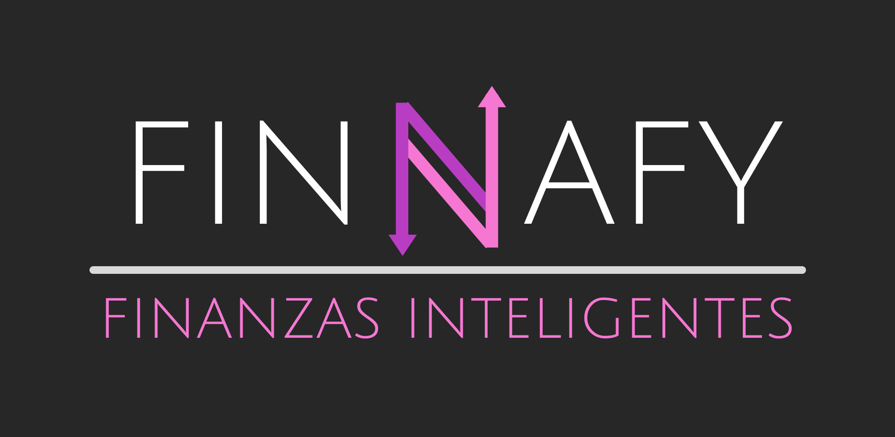

  
  
  
  
  
  
  

  

FINNAFY es una aplicación web básica de JavaScript que permite a los usuarios registrar sus ingresos y gastos diarios, ver el total de cada uno, y determinar su saldo disponible. También incluye funciones para registrar ahorros y presupuestos, ayudando a los usuarios a regular sus transacciones y así alcanzar sus objetivos en función de sus ingresos y gastos.

## Uso

- **Añadir objetivo**: Establece objetivos de ahorro y controla el progreso de cada uno desde el panel 'Mis objetivos'.
- **Añadir presupuesto**: Determina montos a gastar por períodos semanales o mensuales y observa su evolución desde el panel 'Mis presupuestos'.
- **Registrar gasto**: Determina un monto a restar de tu total neto y diferencialos según las categorías provistas. Debes tener un total de dinero suficiente para registrar un gasto.
- **Registrar ingreso**: Agrega una suma de dinero a tu total neto categorizando tus ingresos.
- **Registrar ahorro**: Destina una parte de tu total neto a ahorrar para uno de tus objetivos. Debes tener al menos un objetivo establecido por completar.
- **Historiales**: Observa el registro de transacciones históricas para cada tipo de movimiento.
- **Resúmenes**: Analiza tus totales gastados e ingresados por categoría.
- **Sistema de sesiones**: Puedes guardar, cargar o descartar cualquier cambio a tu elección.

## Dependencias (CDN)

Este proyecto utiliza las siguientes librerías a través de CDN:

- **SweetAlert2**:  
  ``

- **Toastify**:  
  ``

- **AnimateCSS**:  
  `<link rel="stylesheet" href="https://cdnjs.cloudflare.com/ajax/libs/animate.css/4.1.1/animate.min.css"/>`

## Contribuyentes

[Jonas-Weimann](https://github.com/Jonas-Weimann)

